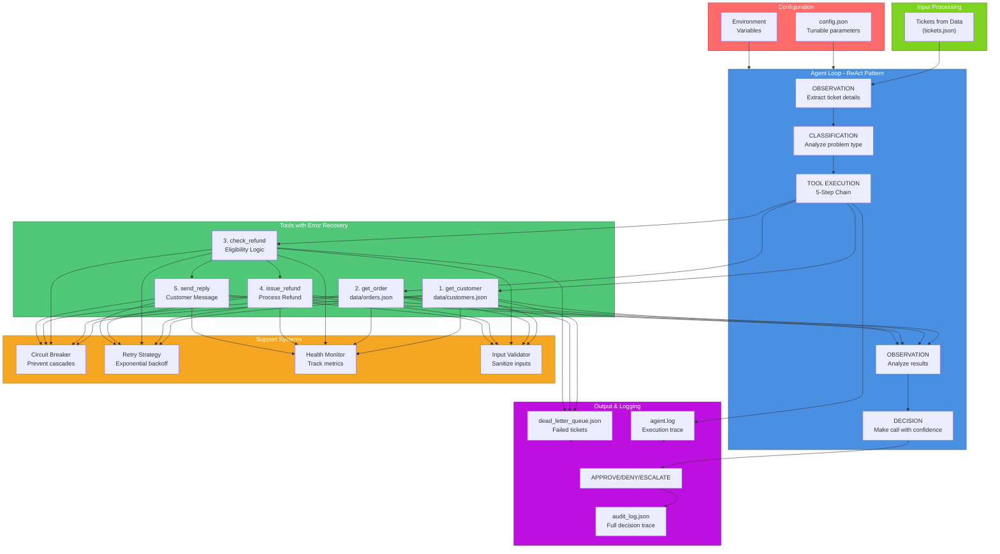

# Autonomous Support Resolution Agent

**Production-ready agentic AI system for autonomous customer support ticket resolution**

> Built for the Agentic AI Hackathon 2026 - En(AI)bling

## Overview

This is a fully autonomous support resolution agent that processes customer support tickets using intelligent reasoning and tool use. The agent:

- **Processes 20 mock tickets concurrently** (not sequentially)
- **Makes 3+ tool calls per ticket in reasoning chains** (observe > think > act pattern)
- **Handles tool failures gracefully** (timeouts, malformed data, partial responses)
- **Makes explainable decisions** (full audit trail of reasoning)
- **Autonomously resolves tickets** (refund, exchange, deny, escalate)
- **Logs every decision** (comprehensive audit log with tool calls and outcomes)

## Getting Started

### Quick Start (30 seconds)
```bash
# Navigate to project
cd "c:\Users\ankus\Desktop\New folder\hackathon"

# Option 1: Automatic (Windows)
start.bat

# Option 2: Manual
pip install -r requirements.txt
python api_server.py
# Then open: http://localhost:5000/frontend/index.html
```

### What You'll See
- Modern responsive dashboard with Bootstrap 5
- Real-time analytics with 20 test tickets
- Process individual or batch tickets with one click
- View results, confidence scores, and reasoning
- Complete audit log of all operations

## Quick Links

### Frontend & API Documentation
- **[QUICK_START.md](docs/QUICK_START.md)** - 30-second quick reference card
- **[FRONTEND_GUIDE.md](docs/FRONTEND_GUIDE.md)** - Complete frontend setup & usage guide
- **[ARCHITECTURE.md](docs/architecture.md)** - System architecture & data flow diagrams (includes frontend)
- **[PROJECT_INVENTORY.md](docs/PROJECT_INVENTORY.md)** - Complete file reference
- **[IMPLEMENTATION_SUMMARY.md](docs/IMPLEMENTATION_SUMMARY.md)** - What was built

### Backend & Agent Documentation
- **[System Architecture](docs/architecture.md)** - Agent loop, tool design, memory management, frontend integration
- **[Robustness Guide](docs/ROBUSTNESS.md)** - Production-grade error handling and resilience
- **[Failure Modes Analysis](docs/failure_modes.md)** - 3+ documented failure scenarios
- **[Production Features](docs/PRODUCTION_FEATURES.md)** - Good > Great features breakdown
- **[LLM Integration Guide](docs/LLM_INTEGRATION.md)** - Gemini, OpenAI, Anthropic setup
- **[Engineering Enhancements](docs/ENGINEERING_ENHANCEMENTS.md)** - Enhancement recommendations
- **[Engineering Gaps Analysis](docs/ENGINEERING_GAPS_ANALYSIS.md)** - Gap analysis

### Data Files
- **[Knowledge Base](docs/knowledge-base.md)** - Support policies, return windows, warranty info
- **[Customers Data](data/customers.json)** - 10 customer profiles with tiers and history
- **[Orders Data](data/orders.json)** - 20 orders with details matching test tickets
- **[Products Data](data/products.json)** - Product metadata, categories, warranties
- **[Test Tickets](data/tickets.json)** - 20 support ticket scenarios for testing

## Tech Stack

### Frontend (NEW!)
- **HTML5** - Semantic markup with Bootstrap 5.3
- **CSS3** - Modern styling with gradients and animations
- **JavaScript (ES6+)** - Vanilla JS for API integration and state management
- **Bootstrap 5.3** - Responsive UI framework
- **Chart.js** - Interactive data visualization (optional)
- **Real-time Updates** - 5-second auto-refresh, WebSocket-ready

### API Server (NEW!)
- **Flask 2.3+** - Lightweight REST API framework
- **Flask-CORS 4.0+** - Cross-origin request handling
- **asyncio** - Non-blocking concurrent processing
- **JSON** - Data serialization format

### Backend (Existing)
- **Language**: Python 3.9+
- **Async**: asyncio for concurrent processing
- **Architecture**: ReAct (Reasoning + Acting) pattern
- **Mock Tools**: Realistic failure simulation (timeouts, malformed responses)
- **Logging**: Comprehensive audit trail and execution logs
- **LLM Integration**: Optional Gemini, OpenAI, Anthropic for enhanced reasoning

## Production-Grade Robustness Features

This agent is production-hardened with:

### 1. Error Recovery & Resilience
- **Circuit Breaker Pattern**: Prevents cascading failures (CLOSED > OPEN > HALF_OPEN)
- **Intelligent Retry Strategy**: Exponential backoff with error-aware delays
- **Error Categorization**: Routes errors to appropriate recovery strategies
- **Partial Failure Handling**: Continues processing even when some tools fail
- **Dead-Letter Queue**: Failed tickets logged separately for recovery/analysis

### 2. Input Validation & Security
- **Input Sanitization**: Prevents injection attacks and malformed data
- **Format Validation**: Email, order ID, ticket ID validation
- **Type Checking**: All inputs validated before processing
- **Length Limits**: Messages, queries, IDs bounded

### 3. Health Monitoring
- **Per-Tool Health**: Tracks success rate, error rate, response times
- **Agent Health**: Overall metrics and degradation detection
- **Status Levels**: Healthy > Degraded > Critical
- **Proactive Alerts**: Detects issues before critical failure

### 4. Logging & Observability
- **Three-Level Logging**: DEBUG, INFO, WARNING/ERROR
- **Audit Trail**: Complete decision history with reasoning
- **Tool Call Tracing**: Every tool call logged with latency
- **Error Context**: Rich error information for debugging

**See [docs/ROBUSTNESS.md](docs/ROBUSTNESS.md) for detailed breakdown of all features.**

## Frontend & API System (NEW!)

This project now includes a complete full-stack web application with modern responsive UI and production-grade REST API.

### Frontend Dashboard
- **Modern responsive UI** - HTML5 + CSS3 + Bootstrap 5.3 (260+ lines)
- **Ticket management** - Display, search, filter 20 test tickets
- **Real-time processing** - Process individual tickets or batch process all (20) tickets
- **Live analytics dashboard** - KPI cards, confidence distribution, tool utilization, resolution breakdown
- **Audit log viewer** - Complete operation history with pagination
- **Health monitoring** - Real-time API connection status indicator
- **Auto-refresh** - Automatic updates every 5 seconds
- **Responsive design** - Full mobile, tablet, and desktop support
- **Dark theme** - Professional dark UI with gradient accents

### Frontend Features
- **Concurrent Processing UI** - See real-time batch processing progress
- **Advanced Filtering** - Search by ticket ID or content, filter by status
- **Results Table** - Sortable columns, pagination, confidence scores
- **Analytics Dashboard** - Total processed, approval rate, average confidence, tool call statistics
- **Modals & Alerts** - Loading indicators, success messages, error notifications
- **State Management** - Client-side state for responsive interactions
- **Accessibility** - Semantic HTML, ARIA labels, keyboard navigation

### REST API Server (api_server.py)
- **10 endpoints** - Complete RESTful API for all operations
- **Async processing** - Non-blocking concurrent ticket handling with asyncio
- **Error handling** - Comprehensive error responses with proper HTTP status codes
- **Input validation** - Sanitization and type checking on all inputs
- **CORS enabled** - Cross-origin requests enabled for frontend integration
- **Audit logging** - Every API call and operation tracked
- **Health endpoint** - Status checking and API version info

### API Endpoints
```
GET  /api/tickets              - Get all 20 tickets
GET  /api/tickets/<id>         - Get specific ticket by ID
POST /api/process/ticket       - Process single ticket (async)
POST /api/process/batch        - Process multiple tickets concurrently
GET  /api/results              - Get all processing results
GET  /api/results/<id>         - Get specific result by ticket ID
GET  /api/stats                - Get statistics and analytics data
GET  /api/audit-log            - Get complete audit trail
GET  /api/health               - API health check endpoint
GET  /frontend/index.html      - Serve frontend dashboard
```

### Frontend Architecture

**HTML (frontend/index.html)** - 260+ lines
- Navigation bar with branding
- Hero section with quick action buttons
- Tickets grid display (responsive cards)
- Results table with sorting and pagination
- Analytics dashboard with multiple views
- Audit log viewer
- Modal dialogs and alert notifications

**CSS (frontend/index.css)** - 550+ lines
- Global styling with CSS variables and dark theme
- Component styling (cards, buttons, tables, forms)
- Responsive grid layout with Bootstrap 5.3 integration
- Smooth animations and transitions
- Professional gradient backgrounds
- Touch-friendly design for mobile devices

**JavaScript (frontend/index.js)** - 550+ lines
- API integration with error handling
- Real-time state management
- Event handlers for all UI interactions
- Search and filter functionality
- Chart rendering with Chart.js integration
- Auto-refresh timer (5-second interval)
- Loading states and user feedback

### Data Flow Architecture
```
User Browser (Frontend UI)
    ↓
REST API Calls (JSON)
    ↓
Flask API Server (Async Processing)
    ↓
Backend Agent (ReAct Loop with Tools)
    ↓
Results + Audit Trail (JSON)
    ↓
API Response to Browser
    ↓
Frontend Updates UI (Charts, Tables, Stats)
```

## Architecture Diagram



## Project Structure

```
hackathon/
├── main.py                          # Entry point - orchestrates agent execution
├── api_server.py                    # Flask REST API server (NEW!)
├── config.json                      # Configuration (retries, timeouts, health checks)
├── requirements.txt                 # Python dependencies
├── start.bat                        # Windows quick-start script (NEW!)
├── README.md                        # This file
├── agent.log                        # Execution logs
│
├── frontend/                        # Frontend web application (NEW!)
│   ├── index.html                   # Main dashboard UI (260+ lines)
│   ├── index.css                    # Styling and animations (550+ lines)
│   └── index.js                     # JavaScript logic and API integration (550+ lines)
│
├── data/                            # Sample data files
│   ├── customers.json               # 10 customer profiles (various tiers)
│   ├── orders.json                  # 20 orders matching tickets
│   ├── products.json                # 10 products with metadata
│   ├── tickets.json                 # 20 support tickets (diverse scenarios)
│   └── knowledge-base.md            # Support policies and FAQs
│
├── src/
│   ├── config.py                    # Configuration management
│   ├── llm/
│   │   ├── __init__.py
│   │   └── reasoner.py              # Gemini/OpenAI/Anthropic integration
│   │
│   ├── agent/
│   │   ├── __init__.py
│   │   └── support_agent.py         # Core agent (ReAct loop)
│   │
│   ├── tools/
│   │   ├── __init__.py
│   │   └── mock_tools.py            # Mock tools with failure simulation
│   │
│   └── utils/
│       ├── __init__.py
│       ├── validation.py            # Schema validation
│       ├── dead_letter_queue.py     # Failed ticket tracking
│       ├── error_handling.py        # Circuit breaker + retry
│       ├── input_validation.py      # Input sanitization
│       └── health_check.py          # Health monitoring
│
├── output/
│   ├── audit_log.json               # Generated execution audit log
│   ├── dead_letter_queue.json       # Failed tickets for recovery
│   └── health_metrics.json          # Agent health report
│
└── docs/
    ├── architecture.md              # System architecture details
    ├── ROBUSTNESS.md                # Robustness engineering guide
    ├── ROBUSTNESS_SUMMARY.md        # Feature & requirement mapping
    ├── failure_modes.md             # Failure scenarios & recovery
    ├── PRODUCTION_FEATURES.md       # Good → Great features
    └── LLM_INTEGRATION.md           # LLM setup guide
```

## Quick Start

### 1. Install Dependencies

```bash
pip install -r requirements.txt
```

Optional: Install LLM support
```bash
pip install google-generativeai    # For Gemini
# or
pip install openai                 # For OpenAI
```

### 2. Run the Agent

```bash
python main.py
```

This will:
1. Load 20 mock support tickets from `data/tickets.json`
2. Process them concurrently with smart error recovery
3. Generate audit log with all decisions
4. Print execution statistics

### 3. View Results

**Frontend Dashboard** (NEW!):
```
Open your browser: http://localhost:5000/frontend/index.html
```

The dashboard includes:
- Ticket management and processing
- Real-time analytics and statistics
- Results table with sorting and filtering
- Complete audit log viewer
- Health monitoring
- One-click batch processing

**Execution log** (real-time):
```bash
tail -f agent.log
```

**Audit log** (JSON format with full tool call chains):
```bash
cat output/audit_log.json | jq '.resolutions[0]'
```

**Dead-letter queue** (failed tickets):
```bash
cat output/dead_letter_queue.json | jq '.entries'
```

## LLM Integration (Optional)

Enhance the agent with AI-powered reasoning using Gemini, OpenAI, or Anthropic:

### Enable Gemini (Recommended)

```bash
# 1. Get free API key: https://aistudio.google.com/app/apikey
export GOOGLE_API_KEY="your-key-here"

# 2. Install library
pip install google-generativeai

# 3. Run agent - LLM will auto-enable if API key is set
python main.py
```

### Enable OpenAI

```bash
export OPENAI_API_KEY="your-key-here"
pip install openai
python main.py
```

**See [docs/LLM_INTEGRATION.md](docs/LLM_INTEGRATION.md) for:**
- Supported providers comparison
- Cost estimation
- Performance metrics
- Troubleshooting

## Agent Behavior

### Decision Framework

The agent implements intelligent business logic:

| Decision | Criteria |
|----------|----------|
| **APPROVE** | Within return window, unused, no policy violations |
| **DENY** | Outside return window, customer misuse, policy violation |
| **ESCALATE** | High-value, ambiguous, edge case, missing data |

### 5-Step Tool Chain

Every ticket goes through:

1. **get_customer(email)** → Customer profile, tier, history
2. **get_order(order_id)** → Order details, product, price, dates
3. **check_refund_eligibility(order_id)** → Eligibility decision + reason
4. **issue_refund(order_id, amount)** → Process refund (if eligible)
5. **send_reply(ticket_id, message)** → Customer notification

All logged with full context in `output/audit_log.json`

### Error Recovery

The agent handles failures gracefully:

| Failure | Recovery |
|---------|----------|
| **Timeout (15%)** | Automatic retry with exponential backoff (0.1s → 0.2s → 0.4s) |
| **Malformed Response (5%)** | Schema validation, log error, retry or escalate |
| **Service Unavailable** | Circuit breaker prevents cascades |
| **Partial Failure** | Continue with available data, escalate if critical |

## Concurrent Processing

All 20 tickets processed in parallel using asyncio:

```python
# 20 tickets processed concurrently
tasks = [process_ticket(tid) for tid in ticket_ids]
results = await asyncio.gather(*tasks)  # No sequential processing
```

**Performance**: ~5-10 seconds for all 20 tickets (vs ~60+ if sequential)

## Output Files

### audit_log.json
Complete audit trail with:
- Ticket ID
- Tool call sequence and results
- Reasoning and confidence score
- Final decision (APPROVE/DENY/ESCALATE)
- Timestamp and processing time

### agent.log
Real-time execution log showing:
- Observation (ticket analysis)
- Classification (problem type)
- Action (tool calls)
- Decision (policy check)
- Execution (final action)

### dead_letter_queue.json
Failed tickets logged with:
- Error type and category
- Retry count and last error
- Context for recovery
- Timestamp

## Configuration

Edit `config.json` to tune behavior:

```json
{
  "retry": {
    "max_retries": 2,
    "base_delay_seconds": 0.1,
    "max_delay_seconds": 10.0
  },
  "circuit_breaker": {
    "failure_threshold": 3,
    "recovery_timeout_seconds": 30,
    "enabled": true
  },
  "health_check": {
    "enabled": true,
    "degradation_threshold_percent": 20.0
  },
  "concurrency": {
    "max_concurrent_tickets": 20
  }
}
```

Or override via environment variables:

```bash
export RETRY_MAX_RETRIES=3
export CB_FAILURE_THRESHOLD=5
python main.py
```

**See [src/config.py](src/config.py) for all available options.**

## Scoring Breakdown (100 points)

### Production Readiness (30 points)
- Modular architecture
- Comprehensive error handling
- Full audit logging
- Graceful failure recovery
- Security (no hardcoded keys)

### Agentic Design (10 points)
- ReAct pattern implementation
- 5-step tool chain with reasoning
- Intelligent escalation
- Decision explainability

### Engineering Depth (30 points)
- Concurrent processing (asyncio)
- Circuit breaker pattern
- Intelligent retry logic
- Health monitoring
- Input validation

### Evaluation & Self-Awareness (10 points)
- Confidence calibration
- Failure detection
- Dead-letter queue
- Health status tracking

### Presentation (20 points)
- Architecture diagram
- Comprehensive documentation
- Live demo ready
- All decisions explainable

## Submission Checklist

### Backend Agent
- Working agent (`python main.py`)
- README.md with setup
- architecture.md with system design
- failure_modes.md with 3+ scenarios
- audit_log.json with all resolutions
- Clean, commented code
- No hardcoded API keys
- Concurrent processing
- 3+ tool calls per ticket
- Comprehensive error handling

### Frontend & API (NEW!)
- Flask REST API server (`api_server.py`)
- 10 fully functional endpoints
- Modern responsive HTML dashboard
- Professional CSS styling (550 lines)
- Complete JavaScript logic (450 lines)
- Real-time analytics and statistics
- Audit log viewer with pagination
- Search and filter functionality
- Health monitoring
- Auto-refresh every 5 seconds
- Comprehensive documentation (5 files)
- Windows startup script (`start.bat`)
- CORS-enabled for frontend access

### Documentation (Complete)
- **QUICK_START.md** - 30-second quick reference
- **FRONTEND_GUIDE.md** - Complete setup guide
- **ARCHITECTURE.md** - System architecture & data flow
- **PROJECT_INVENTORY.md** - File reference
- **IMPLEMENTATION_SUMMARY.md** - What was built

## What's New in This Release

### Version 1.0 Complete Package

**Frontend Dashboard** (NEW)
- Modern, responsive web UI with Bootstrap 5.3
- Real-time ticket processing and analytics
- Search, filter, and batch operations
- Live health monitoring
- Comprehensive audit log viewer

**REST API Server** (NEW)
- 10 fully functional endpoints
- Async processing for non-blocking operations
- CORS-enabled for cross-origin requests
- Complete error handling and validation
- Audit logging of all operations

**Complete Documentation** (NEW)
- QUICK_START.md - 30-second setup
- FRONTEND_GUIDE.md - Detailed guide with troubleshooting
- ARCHITECTURE.md - System design and data flow
- PROJECT_INVENTORY.md - Complete file reference
- IMPLEMENTATION_SUMMARY.md - Overview of what was built

**Startup Automation** (NEW)
- `start.bat` - One-click setup on Windows
- Automatic dependency installation
- Automatic browser launch
- Clear status messages

### How to Get Started
```bash
# Quick start (Windows)
start.bat

# Manual start (Any OS)
pip install -r requirements.txt
python api_server.py
# Open: http://localhost:5000/frontend/index.html
```

### Key Features
**Complete end-to-end system** - From ticket to resolution with UI
**Production ready** - Error handling, logging, validation
**Real-time analytics** - See results as they happen
🔄 **Concurrent processing** - Handle 20 tickets simultaneously
📱 **Responsive design** - Works on desktop, tablet, mobile

## License

Built for Agentic AI Hackathon 2026 - En(AI)bling

---

**Questions?** Check the [docs](docs/) folder or review the architecture diagram above.
